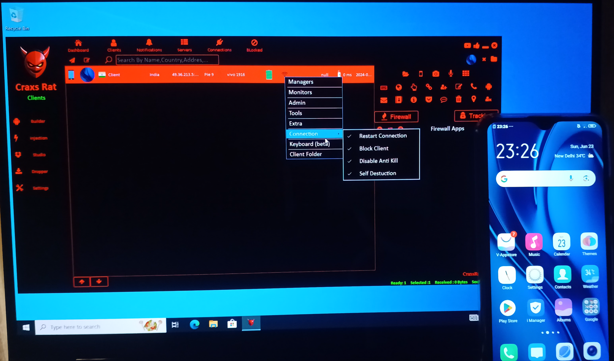

# CraxsRAT — Android RAT Threat Analysis

> An educational, **defense-oriented** case study of the CraxsRAT Android Remote Access Trojan family: its capabilities, attack chain, MITRE ATT&CK (Mobile) mapping, behavioral indicators, and mitigations.

[](#disclaimer)
[](#disclaimer)
[](https://attack.mitre.org/matrices/mobile/)
[](LICENSE)

---

## ⚠️ Disclaimer

This repository is a **threat-analysis and awareness** project created for **cybersecurity education**. It documents the *observed behavior* of a known Android malware family so that defenders, students, and researchers can better **detect, understand, and defend against** this class of threat.

- It contains **no malware, no payloads, no source code, no builder, and no step-by-step instructions for building, deploying, or operating any RAT.**
- Nothing here should be used to compromise any device you do not own or lack **explicit written authorization** to test.
- All figures are annotated analysis of an adversary's capabilities, included to illustrate the threat — not as an operator's guide.
- Unauthorized access to computers and mobile devices is a crime in most jurisdictions (e.g., the U.S. CFAA, the UK Computer Misuse Act, India's IT Act §43/§66). **Do not do it.**

If you want to study samples hands-on, see [`docs/07-safe-analysis-lab.md`](docs/07-safe-analysis-lab.md) for how to build a fully isolated lab that never touches a real victim.

---

## What is CraxsRAT?

CraxsRAT is a commercially sold **Android Remote Access Trojan** that has appeared in commodity-malware and spyware campaigns. Operators use a Windows-based builder to generate trojanized Android apps (APKs) that, once installed, give the operator remote surveillance and control over the infected device.

It is representative of a broader class of **Android RAT/stalkerware** (e.g., SpyNote, Hydra, Cerberus-style families) whose core abuse pattern is the same: **trick the user into installing a disguised app, abuse Android Accessibility Services for control, then exfiltrate data and surveil the victim.** Understanding one well transfers to the whole class.

## Why this project exists

Mobile RATs are one of the fastest-growing threats to individuals and enterprises, yet they are under-represented in most defender training. This case study turns a real-world threat into a structured learning resource:

- Map a RAT's capabilities to a recognized framework (**MITRE ATT&CK for Mobile**).
- Translate "what the attacker does" into **"what the defender should look for."**
- Provide concrete **IOCs, detection ideas, and mitigations** for users, enterprises, and app developers.

## Capability evidence (operator console)

The figures below are annotated analysis of the CraxsRAT **operator console** — shown to illustrate *what this class of threat can do to a victim* so defenders can recognize and counter it. Full analysis in [`docs/03-capability-analysis.md`](docs/03-capability-analysis.md).

> These are capability figures for a threat report. The repository contains no malware, builder, or payload.

**Command & Control — device check-in.** How the implant beacons to an operator server; the behavior defenders hunt for on the network (see [Detection & IOCs](docs/05-detection-and-iocs.md)).



**Screen capture / mirroring.** Live screen read exposes everything the victim views and types — credentials, messages, and on-screen OTP codes.


**Remote camera control.** Covert activation of the device camera — a surveillance capability flagged by the Android 12+ camera indicator.


**Remote file access.** Browsing the device filesystem enables data exfiltration of documents and media.


> The remaining console screenshots are catalogued in [`docs/03-capability-analysis.md`](docs/03-capability-analysis.md). To publish a text-only version, delete `images/` and the figure tables — the analysis stands on its own.

## Repository structure

```
craxsrat-threat-analysis/
├── README.md                      # You are here
├── LICENSE
├── .gitignore
├── docs/
│   ├── 01-overview.md             # Family background & threat context
│   ├── 02-attack-chain.md         # Infection lifecycle (defender's view)
│   ├── 03-capability-analysis.md  # Observed capabilities, annotated
│   ├── 04-mitre-attack-mapping.md # Techniques → ATT&CK (Mobile) IDs
│   ├── 05-detection-and-iocs.md   # Behavioral indicators & detection
│   ├── 06-mitigations.md          # Defenses for users / orgs / devs
│   └── 07-safe-analysis-lab.md    # Isolated lab for responsible study
├── images/                        # Annotated capability figures
└── references.md                  # Sources & further reading
```

## How to read this repo

1. Start with [Overview](docs/01-overview.md) for context.
2. Follow the [Attack Chain](docs/02-attack-chain.md) to see how infections unfold.
3. Review the [ATT&CK Mapping](docs/04-mitre-attack-mapping.md) and [Detection & IOCs](docs/05-detection-and-iocs.md) for the defensive core.
4. Apply the [Mitigations](docs/06-mitigations.md).

## Key defensive takeaways

- **Accessibility Services are the crown jewels.** Nearly all Android RAT control flows through abused Accessibility permissions. Any app requesting Accessibility that isn't an assistive tool deserves scrutiny.
- **Sideloaded APKs are the primary delivery vector.** Keeping "Install unknown apps" disabled blocks most of these campaigns outright.
- **Behavior beats signatures.** These families repackage and obfuscate constantly; detection should lean on permission anomalies, Accessibility abuse, and C2 network behavior rather than file hashes alone.

## Author

Independent cybersecurity study project. Built to demonstrate threat-analysis and blue-team documentation skills.

## License

Documentation released under the [MIT License](LICENSE). Screenshots are included under fair-use for educational commentary and analysis.
